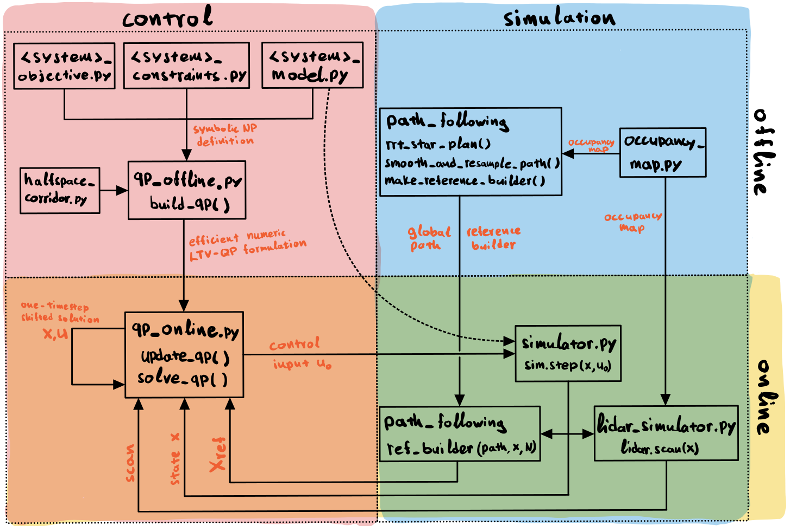
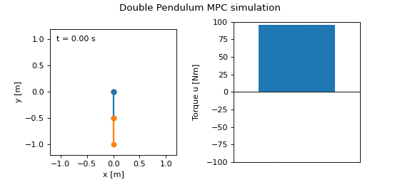
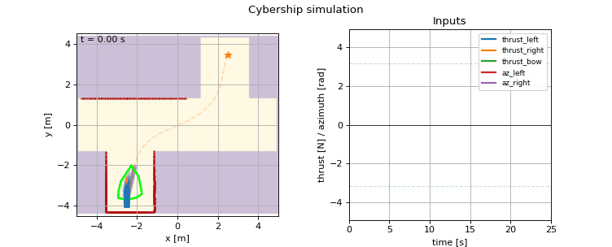

# 🧭 nav_mpc — Realtime Nonlinear MPC for Autonomous Navigation

**nav_mpc** is a lightweight, high-performance Python framework for navigation using **real-time** Model Predictive Control (MPC). MPC is an attractive control approach because it naturally handles constraints of different types and flexibly incorporates diverse control objectives. 

However, nonlinear MPC is often computationally expensive. For many systems, the solver time can exceed the control-loop period, especially on embedded hardware where computation is limited. 

In contrast, Quadratic Programs (QPs) can be solved extremely quickly, and OSQP is particularly well suited for this. The core idea behind this framework is to convert a fully nonlinear MPC problem into a Linear Time-Varying (LTV) MPC problem that can be solved fast enough so that the linearization error remains small and does not degrade system performance.

The framework combines:

- **Symbolic definition**: Users define the nonlinear dynamics, constraints, and objective symbolically, exactly as they would on paper. 
- **Automatic QP formulation** : The framework linearizes the original problem and constructs the corresponding parametric QP approximation automatically. 
- **Cython compilation**: All functions that must be evaluated online for the parametric QP are compiled with Cython to achieve optimal runtime performance. 
- **Real-time OSQP solving**: The QP is solved with OSQP extremely fast, using a configurable time limit to guarantee real-time feasibility. 
- **Integrated simulator for rapid prototyping**: The same symbolic model used by the MPC is also used for simulation, with built-in plotting and animation tools to iterate quickly for rapid development before deploying on embedded hardware.
- **Integrated ROS2 functionality**: The core functionality of nav_mpc and the simulation harness are wrapped with ROS2 nodes to test the framework in asynchronous, ROS-style information exchange.

Together, these components enable deterministic nonlinear MPC on modest hardware, suitable for embedded robotic applications such as **UGVs**, **USVs**, **UAVs**, and more.

<p align="center">
  
</p>

<p align="center"><em>Architecture overview of nav_mpc: symbolic nonlinear MPC compiled into real-time LTV-QP control with integrated simulation loop.</em></p>

## 🧠 Math Background: Nonlinear MPC → Real-Time LTV-QP

`nav_mpc` turns a user-defined **continuous-time nonlinear MPC** problem into a **linear time-varying quadratic program (LTV-QP)** that can be updated and solved in real time with OSQP.

The key idea is:

> Nonlinear optimal control is approximated locally by a sequence of fast convex QPs whose structure stays fixed while their numerical values update online.


### User-defined problem (continuous-time NMPC)

The user defines (symbolically):

- dynamics: $\dot{x}(t) = f(x(t), u(t))$
- constraints: $g(x(t), u(t)) \le 0$
- tracking / objective error: $e(x(t), r(t))$

These expressions may be **fully nonlinear**.

A standard continuous-time NMPC problem over horizon $T = N\,\Delta t$ is:

$$
\min_{u(\cdot)}
\int_{0}^{T}
\left(
\tfrac12 e(x(t),r(t))^\top Q e(x(t),r(t))
+
\tfrac12 (u(t)-u_{\mathrm{ref}})^\top R (u(t)-u_{\mathrm{ref}})
\right) dt
+ \tfrac12 e(x(T),r(T))^\top Q_N e(x(T),r(T))
$$

$$
\text{s.t. }
\dot{x}(t)=f(x(t),u(t)),\quad
g(x(t),u(t))\le 0,\quad
x(0)=x_{\text{meas}}
$$

where $e,f,g$ are nonlinear functions.


### LTV-MPC and QP formulation in OSQP

To obtain a tractable real-time problem, we approximate the nonlinear system **locally** at each MPC step.

We maintain a **linearization trajectory** $ \{\bar{x}_k,\bar{u}_k\}_{k=0}^{N-1} $  typically the shifted previous optimal solution. All nonlinear terms are linearized around these operating points. The resulting finite-horizon optimal control problem becomes a **linear time-varying MPC**:

$$ \begin{aligned} \min_{x, u} \quad & (x_N-x_r)^\top Q_N (x_N-x_r) + \sum_{k=0}^{N-1} \left( (x_k-x_r)^\top Q (x_k-x_r) + (u_k-u_{\mathrm{ref}})^\top R (u_k-u_{\mathrm{ref}}) \right) \\ \text{s.t.} \quad & x_{k+1} = A_k x_k + B_k u_k + c_k, \quad k=0,\ldots,N-1 \\ & x_{\min,k} \le x_k \le x_{\max,k}, \quad k=0,\ldots,N \\ & u_{\min,k} \le u_k \le u_{\max,k}, \quad k=0,\ldots,N-1 \\ & x_0 = x_{\text{meas}} \end{aligned} $$

This problem is now **quadratic with linear constraints**, which means it can be written as a standard QP.

### Mapping to OSQP canonical form

OSQP expects problems of the form

$
\begin{aligned}
\min_z & \tfrac12 z^\top P z + q^\top z
\\[1mm]
\text{s.t.}\quad & l \le A z \le u.
\end{aligned}
$

We therefore stack all states and inputs into one vector

$
z =
\begin{bmatrix}
x_0\\ \vdots\\ x_N\\
u_0\\ \vdots\\ u_{N-1}
\end{bmatrix},
\qquad
n_z=(N+1)n_x + N n_u.
$

All MPC constraints can be written compactly as

$
A=\begin{bmatrix}A_{\mathrm{eq}}\\ A_{\mathrm{ineq}}\end{bmatrix},\quad
l=\begin{bmatrix}b_{\mathrm{eq}}\\ l_{\mathrm{ineq}}\end{bmatrix},\quad
u=\begin{bmatrix}b_{\mathrm{eq}}\\ u_{\mathrm{ineq}}\end{bmatrix}.
$

Importantly:

> **The sparsity pattern of $P$ and $A$ is constant: Only their numerical values change each MPC step.**

#### Objective function

The quadratic cost has the OSQP form $\tfrac12 z^\top P z + q^\top z$, where the Hessian is block diagonal:

$
P_k=\mathrm{diag}\!\big(Q_0,\ldots,Q_N,\;R_0,\ldots,R_{N-1}\big)
\in \mathbb{R}^{n_z\times n_z}.
$


```text
P_k = blkdiag( Q_0, ..., Q_N, R_0, ..., R_{N-1} )

      [ Q_0    0     ...    0      |   0     ...    0   ]
      [  0    Q_1    ...    0      |   0     ...    0   ]
      [ ...   ...    ...   ...     |  ...    ...   ...  ]
      [  0     0     ...   Q_N     |   0     ...    0   ]
      --------------------------------+-------------------
      [  0     0     ...    0      |  R_0    ...    0   ]
      [  0     0     ...    0      |   0     ...    0   ]
      [ ...   ...    ...   ...     |  ...    ...   ...  ]
      [  0     0     ...    0      |   0     ...  R_{N-1}]
```
The linear term arises from expanding tracking penalties:

$
(x_k-x_r)^\top Q (x_k-x_r)
= x_k^\top Q x_k - 2 x_r^\top Q x_k + \text{const}.
$

Thus

$
q =
\begin{bmatrix}
-\,Q_0 x_r\\
\vdots\\
-\,Q_N x_r\\
-\,R_0 u_{\mathrm{ref}}\\
\vdots\\
-\,R_{N-1} u_{\mathrm{ref}}
\end{bmatrix}.
$

If the tracking error is nonlinear $e(x,r)$, we linearize it:

$
e(x_k,r_k)
\approx e(\bar{x}_k,r_k) + E_k(x_k-\bar{x}_k).
$

Define

$
b_k^e = e(\bar{x}_k,r_k) - E_k \bar{x}_k.
$

Then

$
e(x_k,r_k) \approx E_k x_k + b_k^e.
$

Substituting into the quadratic cost produces a local quadratic approximation:

$
Q_k^{\text{local}} = E_k^\top Q E_k,
\qquad
q_k^{\text{local}} = E_k^\top Q b_k^e.
$

This is how nonlinear objectives become QP-compatible.


#### Dynamics (equality constraints)

Using the **linearization trajectory** $\{\bar{x}_k,\bar{u}_k\}_{k=0}^{N-1}$ we discretize and linearize the dynamics around $(\bar{x}_k,\bar{u}_k)$:

$
x_{k+1} \approx A_k\,x_k + B_k\,u_k + c_k,
$

where $A_k,B_k,c_k$ are produced from exact symbolic Jacobians and a (2nd-order) Taylor discretization:

$
A_k = A_d(\bar{x}_k,\bar{u}_k),\quad
B_k = B_d(\bar{x}_k,\bar{u}_k),\quad
c_k = c_d(\bar{x}_k,\bar{u}_k).
$

Stacked into OSQP equalities, we write the residual form:

$
x_0 = x_{\text{meas}},\qquad
x_{k+1}-A_k x_k - B_k u_k = c_k,\ \ k=0,\ldots,N-1.
$

This yields

$
A_{\mathrm{eq}} z = b_{\mathrm{eq}},
\qquad
b_{\mathrm{eq}}=
\begin{bmatrix}
x_{\text{meas}}\\
c_0\\
\vdots\\
c_{N-1}
\end{bmatrix}
\in\mathbb{R}^{(N+1)n_x}.
$

The matrix $A_{\mathrm{eq}}\in\mathbb{R}^{(N+1)n_x\times n_z}$ has the standard MPC band structure with constant sparsity:

```text
A_eq =
[   I      0      0      ...    0 |  0     0   ...     0   ]
[ -A_0     I      0      ...    0 |-B_0    0   ...     0   ]
[   0    -A_1     I      ...    0 |  0   -B_1  ...     0   ]
[  ...                            | ...                    ]
[   0      0     ...  -A_{N-1}  I |  0     0   ... -B_{N-1}]
```

In OSQP bound form, we enforce equalities by setting:

$
l_{\mathrm{eq}} = u_{\mathrm{eq}} = b_{\mathrm{eq}}.
$

#### Inequalities

Nonlinear inequality constraints $g(x_k,u_k)\le 0$ are linearized per stage:

$
G_k^x x_k + G_k^u u_k \le b_k,
\qquad
b_k := -\Big(g(\bar{x}_k,\bar{u}_k) - G^x_k\bar{x}_k - G^u_k\bar{u}_k\Big).
$

These constraints are stacked into a sparse block $A_g z \le b$. In OSQP bound form, such inequalities use $-\infty$ as the lower bound.

Nonlinear inequality constraints $g(x_k,u_k)\le 0$ are linearized as:

$$
g(x_k, u_k) \approx g(\bar{x}_k, \bar{u}_k) + G_{k}^{x}(x_k - \bar{x}_k) + G_{k}^{u}(u_k - \bar{u}_k) \le 0
$$

Rearranging yields:

$
G^x_k\,x_k + G^u_k\,u_k \le
b_k,\qquad
b_k := -\Big(g(\bar{x}_k,\bar{u}_k) - G^x_k\bar{x}_k - G^u_k\bar{u}_k\Big).
$

All inequalities are stacked into $A_{\mathrm{ineq}} z \le u_{\mathrm{ineq}}$ and represented in OSQP bound form using $(l,u)$ with $l=-\infty$ on inequality rows.

### Offline vs online in `nav_mpc` (how it stays fast)

**Offline (`core/mpc2qp/qp_offline.py`)**
- Build the **fixed sparsity pattern** of $P$ and $A$ once (CSC format).
- Precompute **index maps** pointing to exact memory locations of time-varying entries (e.g., where $-A_k$, $-B_k$, $G^x_k$, $G^u_k$ live inside `A.data`).
- Generate compiled stage kernels via SymPy Jacobians + `autowrap(..., backend="cython")`:
  - $A_k(\bar{x}_k,\bar{u}_k),\ B_k(\bar{x}_k,\bar{u}_k),\ c_k(\bar{x}_k,\bar{u}_k)$
  - $G^x_k(\bar{x}_k,\bar{u}_k),\ G^u_k(\bar{x}_k,\bar{u}_k),\ g(\bar{x}_k,\bar{u}_k)$
  - $e(\bar{x}_k,r_k),\ E_k(\bar{x}_k,r_k)$

**Online (`core/mpc2qp/qp_online.py`)**
- Shift the previous solution to get new linearization points:
  $\bar{x}_k \leftarrow x^*_{k+1}$, $\bar{u}_k \leftarrow u^*_{k+1}$ (with terminal extrapolation).
- Evaluate compiled kernels stage-wise to obtain $\{A_k,B_k,c_k,G^x_k,G^u_k,b_k\}$.
- Overwrite **only** time-varying values in `A.data`, `l`, `u`, and (optionally) `P.data`, `q` using the precomputed index maps (no sparsity changes, no reallocations).
- Call OSQP `prob.update(Px=..., q=..., Ax=..., l=..., u=...)` and solve.

This design leverages the fact that OSQP requires a **constant sparsity pattern**. `nav_mpc` keeps structure fixed and performs fast in-place numeric updates each MPC step.

### Final interpretation

At runtime each MPC iteration performs:

1. Shift previous solution → new linearization points  
2. Evaluate Jacobians → obtain $A_k,B_k,c_k,G_k$  
3. Update numeric entries of $P,q,A,l,u$  
4. Solve QP with OSQP  

Because sparsity is fixed → updates are extremely fast.
Because problem is quadratic → solution is extremely fast.

---

## ✨ Key Features

### 🔧 1. Fully parametric, symbolic MPC pipeline
- Symbolic linearization around operating trajectories
- Automatic Jacobians and discrete-time dynamics
- QP constructed explicitly for transparency & speed

### ⚡ 2. C-accelerated online QP evaluation (SymPy autowrap + Cython) and OSQP solution
- Expensive symbolic expressions compiled to native machine code
- Fast online QP assembly with Cython
- Fast online QP solution with OSQP
- Suitable for Jetson / Raspberry Pi / embedded CPUs

### 🧱 3. Clean modular architecture
```
nav_mpc/
├── core/               # symbolic problem definitions + MPC→QP core
├── simulation/         # map/path/lidar + simulator + plotting/animations
├── utils/              # profiling, debugging, logging, system info
├── nav_mpc_ros/        # ROS 2 package wrapping core/ + simulation/ as nodes
├── docs/               # documents and examples
└── main.py             # ROS-agnostic MPC runner (example entry point)
```

### 🔌 **4. Extensible to arbitrary systems**
- Simple pendulum
- Double pendulum 
- Kinematic Rover (UGV)
- Cybership (ASV)

--- 

## 🎯 Why nav_mpc? 

**nav_mpc** provides:

- An easy way to define a full nonlinear MPC problem — dynamics, constraints, and objectives are written symbolically, just like on paper. 
- A fast development workflow in Python with integrated simulation and result generation, combined with Cython compilation for ultra-fast numerical evaluation. 
- Real-time performance: the controller runs ultra-fast with deterministic timing, making it suitable for embedded hardware with tight control-loop deadlines. 
- A clean, minimal set of dependencies and a research-friendly architecture that enables rapid prototyping, fast iteration, and straightforward extension to new robotic systems. 
- A smooth transition to embedded hardware via ROS2 wrappers. 

---

## 🚀 Getting Started

### 🧪 Install and Run in pure Python (ROS-agnostic)

```bash
git clone https://github.com/ttsolakis/nav_mpc.git
cd nav_mpc
python3 -m venv .venv
source .venv/bin/activate
pip install -r requirements.txt
python main.py
```
This will:
- linearize the nonlinear problem and build the parametric QP offline
- run realtime LTV-MPC in closed loop
- print detailed timing statistics
- generate plots/animations under `results/` (auto-generated at root)

---

### 🤖 Build and Run with ROS2

> This section assumes a working ROS2 installation and an existing colcon workspace (e.g., dev_ws).
> Tested with ROS2 Jazzy on Ubuntu 24.04.

```bash
cd ~/dev_ws
source /opt/ros/<distro>/setup.bash
colcon build --packages-select nav_mpc_ros --symlink-install
source install/setup.bash
ros2 launch nav_mpc_ros nav_mpc_sim.launch.py
```
This will:
- start the full ROS2 simulation pipeline (map, path, lidar, simulator, MPC)
- ROS2 nodes wrap and reuse the same `core/` MPC logic and `simulation/` components
- Spawn RVIZ for visualization

---

## 🕹️ Examples

Examples run with:

OS:       Linux 6.14.0-37-generic  
Machine:  x86_64  
CPU:      Intel(R) Core(TM) i7-7500U CPU @ 2.70GHz  
Cores:    4 logical

---

### Double Pendulum

Double pendulum swing-up and stabilization with LTV-MPC:



Performance with N = 40, dt = 0.02 s on a laptop CPU:

| Stage | Mean | Min | Max |
|-------|-------|-------|-------|
| QP eval | 1.19 ms | 1.12 ms | 2.71 ms |
| QP solve | 0.26 ms | 0.23 ms | 1.47 ms |
| Total MPC | **1.45 ms** | **1.35 ms** | **3.88 ms** |

Notice that Max time for Total MPC can stay deterministically below dt 
while getting optimal performance from OSQP (3.88 ms << 20 ms).

---

### Simple Rover

Simple kinematic rover (unicycle) model path tracking with LTV-MPC and 36 half-space corridor constraints per stage:


Performance with N = 25, dt = 0.1 s on a laptop CPU:

| Stage | Mean | Min | Max |
|-------|-------|-------|-------|
| QP eval | 3.06 ms | 2.77 ms | 5.44 ms |
| QP solve | 0.71 ms | 0.57 ms | 3.05 ms |
| Total MPC | **3.77 ms** | **3.36 ms** | **6.21 ms** |

Notice that Max time for Total MPC can stay deterministically below dt 
while getting optimal performance from OSQP (6.21 ms << 100 ms).

---

### Simple Rover with ROS2

Simple rover running with the full ROS2 navigation pipeline:


---

### Cybership

Cybership model (ASV) path tracking with LTV-MPC and 16 half-space corridor constraints per stage:



Performance with N = 30, dt = 0.1 s on a laptop CPU:

| Stage | Mean | Min | Max |
|-------|-------|-------|-------|
| QP eval | 2.93 ms | 2.56 ms | 4.73 ms |
| QP solve | 1.38 ms | 0.61 ms | 22.56 ms |
| Total MPC | **4.32 ms** | **3.18 ms** | **25.73 ms** |

Notice that Max time for Total MPC can stay deterministically below dt 
while getting optimal performance from OSQP (25.73 ms < 100 ms) even
for a complex nonlinear hydrodynamic ASV model.

---


## 📄 License — MIT

Permissive, suitable for commercial + academic use.

---

## 📖 Citation

If you use this framework in academic work, please cite or link to:

Anastasios Tsolakis, *nav_mpc: Realtime Nonlinear MPC via LTV-MPC*, 
GitHub repository, 2025.


---

## 📬 Contact

Anastasios (Tasos) Tsolakis  
📧 tas.tsolakis@gmail.com  
🌐 https://ttsolakis.github.io

---

> 🚧 **Work in Progress**
>
> This project is under active development. 
> APIs, file structure, and features may change.
> The framework is functional and examples run end-to-end, but some components are still evolving.
