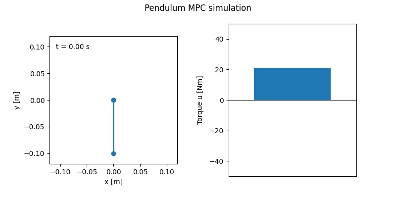
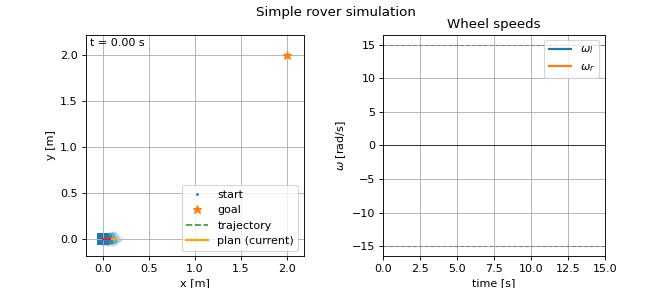

# 🧭 nav_mpc — Realtime Nonlinear MPC for Autonomous Navigation

**nav_mpc** is a lightweight, high-performance Python framework for navigation using **real-time** Model Predictive Control (MPC). 

MPC is an attractive control approach because it naturally handles constraints of different types and flexibly incorporates diverse control objectives. However, nonlinear MPC is often computationally expensive. For many systems, the solver time can exceed the control-loop period, especially on embedded hardware where computation is limited.

In contrast, Quadratic Programs (QPs) can be solved extremely quickly, and OSQP is particularly well suited for this. The core idea behind this framework is to convert a fully nonlinear MPC problem into a Linear Time-Varying (LTV) MPC problem that can be solved fast enough so that the linearization error remains small and does not degrade system performance.

The framework combines:

- **Symbolic definition**: Users define the nonlinear dynamics, constraints, and objective symbolically, exactly as they would on paper.
- **Automatic QP formulation** : The framework linearizes the original problem and constructs the corresponding parametric QP approximation automatically.
- **Cython compilation**: All functions that must be evaluated online for the parametric QP are compiled with Cython to achieve optimal runtime performance.
- **Real-time OSQP solving**: The QP is solved with OSQP extremely fast, using a configurable time limit to guarantee real-time feasibility.
- **Integrated simulator for rapid prototyping**: The same symbolic model used by the MPC is also used for simulation, with built-in plotting and animation 
tools to iterate quickly for rapid development before deploying on embedded hardware.

Together, these components enable nonlinear MPC to run reliably and deterministically even on modest computing platforms, making it suitable for embedded robotic applications such as **ground vehicles (UGVs)**, **surface vessels (USVs)**, **aerial vehicles (UAVs)**, and more.

---

## ✨ Key Features

### 🔧 **1. Fully parametric, symbolic MPC pipeline**
- Symbolic linearization around operating trajectories
- Automatic Jacobians and discrete-time dynamics
- QP constructed explicitly for transparency & speed

### ⚡ **2. C-accelerated QP evaluation via SymPy autowrap + Cython**
- Expensive symbolic expressions compiled to native machine code
- Runtime QP evaluation **up to 5× faster** than simple Python
- Ideal for Jetson, Raspberry Pi, and embedded control CPUs

### 🤖 **3. Clean modular architecture**
```
nav_mpc/
├── models/             # system dynamics (symbolic)
├── constraints/        # system + collision constraints (symbolic)
├── objectives/         # cost functions (symbolic)
├── mpc2qp/             # core functionality: offline QP formulation + fast online updates
├── simulation/         # simulator, plotting, animations
├── utils/              # profiling, debugging, system info
└── wrappers/           # ROS2 interface (coming)
```

### 🔌 **4. Extensible to arbitrary systems**
- Simple pendulum (included)
- Double pendulum (included)
- Kinematic Rover  (coming)


---

## 🎯 Why nav_mpc?
**nav_mpc** provides:
- An easy way to define a full nonlinear MPC problem — dynamics, constraints, and objectives are written symbolically, just like on paper.
- A fast development workflow in Python with integrated simulation and result generation, combined with Cython compilation for ultra-fast numerical evaluation.
- Real-time performance: the controller runs ultra-fast with deterministic timing, making it suitable for embedded hardware with tight control-loop deadlines.
- A clean, minimal set of dependencies and a research-friendly architecture that enables rapid prototyping, fast iteration, and straightforward extension to new robotic systems.

---

## 🚀 Getting Started

### 1️⃣ Installation

```bash
git clone https://github.com/ttsolakis/nav_mpc.git
cd nav_mpc
python3 -m venv .venv
source .venv/bin/activate
pip install -r requirements.txt
```

---

### 2️⃣ Problem Setup (inside `main.py`)

All MPC problems are configured directly in `main.py`.

#### 🔧 General settings

```python
debugging = True         # print solver solution at each step (coming)
profiling = True         # collect timing statistics
show_system_info = True  # print CPU / OS info (Linux only)
```

#### ⏱ Embedded / realtime mode

```python
embedded = True
```

When enabled, a **time limit is set on OSQP** so that the control loop remains realtime-feasible:

```
time_limit = dt - QP_evaluation_time
```

This is essential for embedded hardware and hard real-time control.

---

#### 🤖 System, objective, and constraints

```python
system      = SimplePendulumModel()
objective   = SimplePendulumObjective(system)
constraints = SimplePendulumSystemConstraints(system)
```

These are defined **symbolically** and automatically linearized:

- `system`: nonlinear dynamics
- `objective`: tracking / regulation cost
- `constraints`: state and input limits

Changing the system (e.g. pendulum → rover) requires **no changes to the MPC core**.

---

#### 🎯 Initial and reference states

```python
x_init = np.array([0.0, 0.0])      # initial state
x_ref  = np.array([np.pi, 0.0])    # desired equilibrium
```

Used for trajectory tracking or stabilization.

---

#### 📐 MPC horizon and sampling time

```python
N  = 40     # prediction horizon [steps]
dt = 0.02   # sampling time [s]
```

- Larger `N` → better foresight, higher computation cost
- Smaller `dt` → faster control loop, tighter real-time constraints

---

#### 🧪 Simulation parameters

```python
tsim    = 2.0   # total simulation time [s]
sim_cfg = SimulatorConfig(
    dt=dt,
    method="rk4",
    substeps=10
)
```

The simulator uses the **same nonlinear model** as the MPC, ensuring consistency.

---

### 3️⃣ Run an example

Simply run:

```bash
python main.py
```

This will:

- linearize and build the parametric QP offline
- run realtime LTV-MPC in closed loop
- print detailed timing statistics
- generate plots (generic for any system)
- generate animation (animation is system-specific)

Results are saved to:

```text
nav_mpc/results/
```

Directory is created automatically.

---

### 4️⃣ Interpreting the results

After execution you will see:

- **State trajectories** (with bounds and references)
- **Input trajectories** (with actuator limits)
- **Animations** (pendulum, double pendulum, etc.)
- **Timing statistics** (QP evaluation, QP solution, Total MPC, Simulation)

These numbers demonstrate **deterministic real-time MPC** on modest hardware.

---

## 🧭 Next examples

- ✔ Simple pendulum (included)
- ✔ Double pendulum (included)
- 🚗 Rover kinematic MPC (coming next)

## 🧪 Examples

Examples run with:

OS:       Linux 6.14.0-37-generic  
Machine:  x86_64  
CPU:      Intel(R) Core(TM) i7-7500U CPU @ 2.70GHz  
Cores:    4 logical

---

### Simple Pendulum

Simple pendulum swing-up and stabilization with LTV-MPC:



Performance with N = 40, dt = 0.02 s on a laptop CPU:

| Stage | Mean | Min | Max |
|-------|-------|-------|-------|
| QP eval | 1.12 ms | 1.04 ms | 4.22 ms |
| QP solve | 0.18 ms | 0.13 ms | 0.82 ms |
| Total MPC | **1.29 ms** | **1.18 ms** | **5.04 ms** |

Notice that Max time for Total MPC can stay deterministically below dt 
while getting optimal performance from OSQP (5.04 ms << 20 ms).

---

### Double Pendulum

Double pendulum swing-up and stabilization with LTV-MPC:


Performance with N = 40, dt = 0.02 s on a laptop CPU:

| Stage | Mean | Min | Max |
|-------|-------|-------|-------|
| QP eval | 1.19 ms | 1.12 ms | 2.71 ms |
| QP solve | 0.26 ms | 0.23 ms | 1.47 ms |
| Total MPC | **1.45 ms** | **1.35 ms** | **3.88 ms** |

Notice that Max time for Total MPC can stay deterministically below dt 
while getting optimal performance from OSQP (3.88 ms << 20 ms).

---

### Simple Rover

Simple kinematic rover (unicycle) model set-point tracking with LTV-MPC:



Performance with N = 20, dt = 0.2 s on a laptop CPU:

| Stage | Mean | Min | Max |
|-------|-------|-------|-------|
| QP eval | 0.75 ms | 0.69 ms | 2.38 ms |
| QP solve |0.39 ms | 0.25 ms | 0.90 ms |
| Total MPC | **1.14 ms** | **0.95 ms** | **3.19 ms** |

Notice that Max time for Total MPC can stay deterministically below dt 
while getting optimal performance from OSQP (3.19 ms << 200 ms).

---

## 📄 License — MIT

Permissive, suitable for commercial + academic use.

---

## 📬 Contact

**Anastasios (Tasos) Tsolakis**  
📧 tas.tsolakis@gmail.com  
🌐 https://ttsolakis.github.io  
